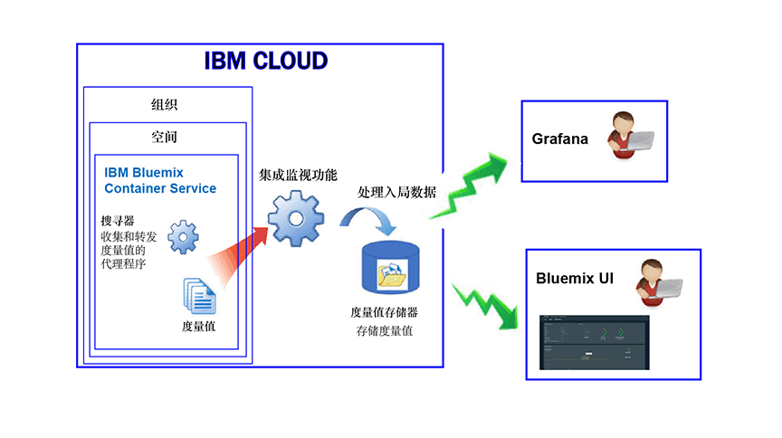

---

copyright:
  years: 2017, 2018

lastupdated: "2018-02-02"

---

{:new_window: target="_blank"}
{:shortdesc: .shortdesc}
{:screen: .screen}
{:pre: .pre}
{:table: .aria-labeledby="caption"}
{:codeblock: .codeblock}
{:tip: .tip}
{:download: .download}

# 在 IBM Cloud 中管理的容器（不推荐）
{: #monitoring_managed_containers_ov}

在 {{site.data.keyword.Bluemix}} 中，系统会从容器外部自动收集容器和工作程序度量值，而不必在容器内部安装和维护代理程序。您可以使用 Grafana 对容器度量值进行可视化表示。
{:shortdesc}

**注：**系统将针对在标准集群中运行的容器收集度量值，并可通过 {{site.data.keyword.monitoringshort}} 服务对这些度量值进行监视。有关标准集群支持的功能的更多信息，请参阅[规划集群和应用程序](/docs/containers/cs_planning.html#cs_planning_cluster_type)。

## 收集缺省度量值
{: #metrics_containers_bmx_ov}

下图显示了 {{site.data.keyword.containershort}} 监视的高级别视图：

缺省情况下，搜寻器会持续从所有容器中收集以下度量值：

* CPU
* 内存
* 网络信息

## 监视 IBM Cloud 中管理的容器的度量值（不推荐）
{: #monitoring_metrics_bmx}

在 {{site.data.keyword.Bluemix_notm}} UI 和 Grafana 中收集和显示度量值：

* 使用 Grafana（一种开放式源代码分析和可视化平台）通过各种图形（例如，图表和表）来对度量值进行监视、搜索、分析和可视化表示。

    可以通过 {{site.data.keyword.Bluemix_notm}} UI 或通过浏览器启动 Grafana。有关更多信息，请参阅[导航至 Grafana 仪表板](/docs/services/cloud-monitoring/grafana/navigating_grafana.html#navigating_grafana)。

* 使用 {{site.data.keyword.Bluemix_notm}} UI，查看最新的度量值。

    要在 {{site.data.keyword.Bluemix_notm}} UI 中查看度量值，请参阅[在 {{site.data.keyword.Bluemix_notm}} 控制台中分析度量值](/docs/services/cloud-monitoring/containers/analyzing_metrics_bmx_ui.html#analyzing_metrics_bmx_ui)。
