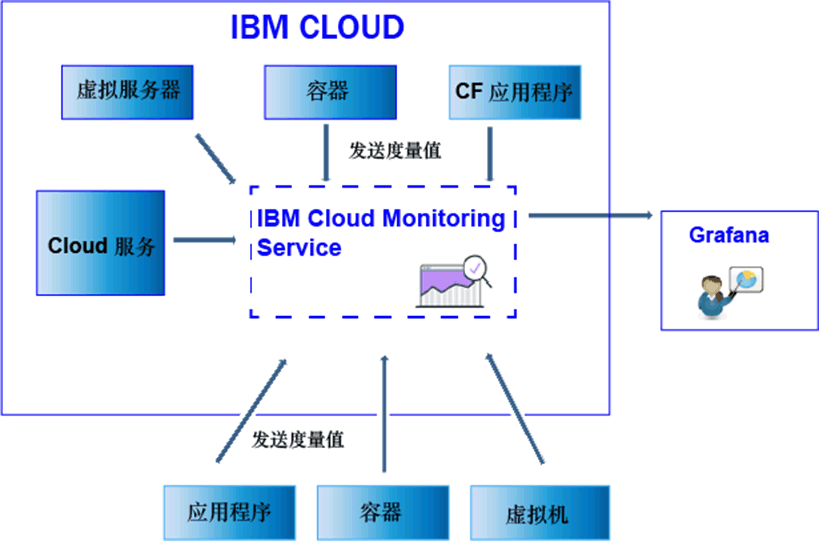

---

copyright:
  years: 2017

lastupdated: "2017-07-10"

---

{:shortdesc: .shortdesc}
{:new_window: target="_blank"}
{:codeblock: .codeblock}
{:screen: .screen}
{:pre: .pre}

# 发送和检索数据
{: #send_retrieve_metrics_ov}

您可以使用“度量值 API”将度量值从 {{site.data.keyword.Bluemix}} 空间检索度量值并发送到 {{site.data.keyword.monitoringshort}} 服务中。
{:shortdesc}

下图显示了可以将其中度量值发送到 {{site.data.keyword.monitoringshort}} 服务的不同资源的高级别视图：

## 发送度量值
{: #send}

对于 {{site.data.keyword.Bluemix_notm}} Docker 容器，会自动收集基本系统度量值。对于 Cloud Foundry 应用程序以及在虚拟机 (VM) 中运行的应用程序，必须使用度量值 API 从应用程序直接发送度量值。 

要将度量值发送到 {{site.data.keyword.monitoringshort}} 服务，请考虑以下信息： 

* 必须设置要从中检索数据的 {{site.data.keyword.Bluemix_notm}} 空间。

* 您必须提供安全性令牌或 API 密钥才能使用 {{site.data.keyword.monitoringshort}} 服务。 

* 您可以使用 API 端点 `https://metrics.ng.bluemix.net/v1/metrics`。有关 API 的更多信息，请参阅[度量值 API](https://console.bluemix.net/apidocs/927-ibm-cloud-monitoring-rest-api?&language=node#introduction){: new_window}。

根据您选择的认证模型，选择以下某个选项以将数据发送到 {{site.data.keyword.monitoringshort}} 服务：
 
* 要使用 UAA 令牌发送度量值，请参阅[使用 UAA 将度量值发送到空间](/docs/services/cloud-monitoring/send-metrics/send_data_api.html#uaa)。

* 要使用 IAM 令牌或 API 密钥发送度量值，请参阅[使用 IAM 或 API 密钥将度量值发送到空间](/docs/services/cloud-monitoring/send-metrics/send_data_api.html#iam)。

## 检索度量值
{: #retrieve}

要检索度量值，请考虑以下信息： 

* 必须设置要从中检索数据的 {{site.data.keyword.Bluemix_notm}} 空间。

* 您必须提供安全性令牌或 API 密钥才能使用 {{site.data.keyword.monitoringshort}} 服务。 

* 必须指定 1 个或多个度量值的路径。有关更多信息，请参阅[定义度量值](/docs/services/cloud-monitoring/retrieve-metrics/retrieve_data_api.html#metrics)。

* （可选）您可以指定定制时间段。缺省情况下，如果未指定时间段，那么检索的数据是与过去 24 小时相对应的数据。有关更多信息，请参阅[配置时间段](/docs/services/cloud-monitoring/retrieve-metrics/retrieve_data_api.html#time)。

* 您可以使用 API 端点 `https://metrics.ng.bluemix.net/v1/metrics`。有关 API 的更多信息，请参阅[度量值 API](https://console.bluemix.net/apidocs/927-ibm-cloud-monitoring-rest-api?&language=node#introduction){: new_window}。

**注：**对于每个请求，最多可以检索 5 个目标。

根据您选择的认证模型，选择以下某个选项以从 {{site.data.keyword.monitoringshort}} 服务检索数据：
 
* 要使用 UAA 令牌检索度量值，请参阅[使用 UAA 将度量值检索到空间](/docs/services/cloud-monitoring/retrieve-metrics/retrieve_data_api.html#uaa)。

* 要使用 IAM 令牌或 API 密钥检索度量值，请参阅[使用 IAM 或 API 密钥将度量值检索到空间](/docs/services/cloud-monitoring/retrieve-metrics/retrieve_data_api.html#iam)。

## 检索度量值列表
{: #show_metrics}

您可以列出空间中可用的度量值。

要列出度量值，请考虑以下信息： 

* 必须设置要列出其可用度量值的 {{site.data.keyword.Bluemix_notm}} 空间。

* 您必须提供安全性令牌或 API 密钥才能使用 {{site.data.keyword.monitoringshort}} 服务。 

* 必须指定一个查询，该查询定义从何处列出度量值的路径。例如，要列出空间中的所有度量值，可以将查询设置为：`query=SpaceGUID.*`，其中 *SpaceGUID* 是空间的 GUID。

    缺省值为 `*`，其指定空间根级别的起点。

* 您可以使用 API 端点 `https://metrics.ng.bluemix.net/v1/metrics/list`。有关 API 的更多信息，请参阅[度量值 API](https://console.bluemix.net/apidocs/927-ibm-cloud-monitoring-rest-api?&language=node#introduction){: new_window}。

 
