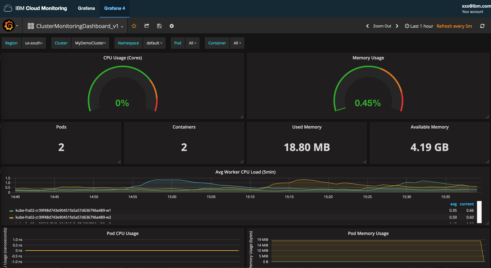

---

copyright:
  years: 2017, 2018

lastupdated: "2018-02-07"

---

{:new_window: target="_blank"}
{:shortdesc: .shortdesc}
{:screen: .screen}
{:pre: .pre}
{:table: .aria-labeledby="caption"}
{:codeblock: .codeblock}
{:tip: .tip}
{:download: .download}


# 在 Grafana 中分析部署在 Kubernetes 集群中的应用程序的度量值
{: #container_service_metrics}

使用本教程可了解如何使用 {{site.data.keyword.monitoringlong}} 服务来监视容器的性能。
{:shortdesc}


## 目标
{: #objectives}

了解如何对部署在 Kubernetes 集群中的应用程序进行容器度量值的搜索和分析：

1. 确定将集群中收集的度量值转发到 {{site.data.keyword.monitoringshort}} 服务的位置。 
2. 启动 Grafana 并设置可以在其中查看集群度量值的 {{site.data.keyword.monitoringshort}} 域。
3. 在 {{site.data.keyword.Bluemix_notm}} 中对部署在 Kubernetes 集群中的应用程序进行容器度量值的搜索和分析。

本教程将逐步执行在 {{site.data.keyword.Bluemix_notm}} 中运行以下端到端场景所需的步骤：供应集群，确定集群将度量值发送到 {{site.data.keyword.Bluemix_notm}} 中 {{site.data.keyword.monitoringshort}} 服务的位置，在集群中部署应用程序，以及使用 Grafana 来查看和过滤该集群的容器度量值。


**注：**要完成本教程，您必须完成不同步骤中链接的先决条件和教程。


## 先决条件
{: #prereqs}

1. 您必须是 {{site.data.keyword.Bluemix_notm}} 帐户的成员或所有者，并有权创建 Kubernetes 标准集群、将应用程序部署到集群以及查询 {{site.data.keyword.Bluemix_notm}} 中的度量值以在 Grafana 中进行监视。

    您的 {{site.data.keyword.Bluemix_notm}} 用户标识必须分配有以下策略：
    
    * 具有*操作员*或*管理员*许可权的 {{site.data.keyword.containershort}} 的 IAM 策略。
    * 具有在其中供应 {{site.data.keyword.monitoringshort}} 服务的空间的 CF 角色并具有*开发者*许可权。
    
    有关更多信息，请参阅[通过 IBM Cloud UI 向用户分配 IAM 策略](/docs/services/cloud-monitoring/security/grant_permissions.html#grant_permissions_ui_account)和[使用 IBM Cloud UI 授予用户 CF 角色](/docs/services/cloud-monitoring/security/grant_permissions.html#grant_permissions_ui_space)。

2.  打开终端会话，您可以在其中通过命令行来管理 Kubernetes 集群和部署应用程序。本教程中提供的示例适用于 Ubuntu Linux 系统。

3. 安装 CLI 以在 Ubuntu 系统中使用 {{site.data.keyword.containershort}}。

    * 安装 {{site.data.keyword.Bluemix_notm}} CLI。有关更多信息，请参阅[安装 {{site.data.keyword.Bluemix_notm}} CLI](/docs/cli/reference/bluemix_cli/download_cli.html#download_install)。
    
    * 安装 {{site.data.keyword.containershort}} CLI 以在 {{site.data.keyword.containershort}} 中创建和管理 Kubernetes 集群，以及将容器化应用程序部署到集群中。有关更多信息，请参阅[安装 CS 插件](/docs/containers/cs_cli_install.html#cs_cli_install_steps)。
    

    
 

## 步骤 1：供应 Kubernetes 集群
{: #step1}

请完成以下步骤：

1. 创建标准 Kubernetes 集群。

   * [通过 UI 创建 Kubernetes 标准集群](/docs/containers/cs_cluster.html#cs_cluster_ui)。
   * [使用 CLI 创建 Kubernetes 标准集群](/docs/containers/cs_cluster.html#cs_cluster_cli)。

2.  在终端中设置集群上下文。设置上下文后，您可以管理 Kubernetes 集群并在 Kubernetes 集群中部署应用程序。

    登录到 {{site.data.keyword.Bluemix_notm}} 中与已创建集群关联的区域、组织和空间。有关更多信息，请参阅[如何登录到 {{site.data.keyword.Bluemix_notm}}](/docs/services/CloudLogAnalysis/qa/cli_qa.html#login)。

	初始化 {{site.data.keyword.containershort}} 服务插件。

	```
	bx cs init
	```
	{: codeblock}

    将终端上下文设置为您的集群。
    
	```
	bx cs cluster-config MyCluster
	```
	{: codeblock}

    运行此命令的输出提供了必须在终端中运行以设置配置文件路径的命令。例如：

	```
	export KUBECONFIG=/Users/ibm/.bluemix/plugins/container-service/clusters/MyCluster/kube-config-hou02-MyCluster.yml
	```
	{: codeblock}

    复制并粘贴用于在终端中设置环境变量的命令，然后按 **Enter** 键。


## 步骤 2：确定集群将度量值转发到 {{site.data.keyword.monitoringshort}} 服务的位置
{: #step2}

集群是帐户级别的资源。在 {{site.data.keyword.containershort}} 上供应集群时，可以在帐户级别创建集群，也可以使用与其关联的 Cloud Foundry (CF) 空间来创建集群。集群供应并准备就绪后，系统会立即自动收集度量值并将其转发到 {{site.data.keyword.monitoringshort}} 服务。

* 关联有 CF 空间的集群会将度量值转发到空间度量值域。
* 在帐户级别创建的集群会将度量值转发到帐户度量值域。

要确定集群将度量值转发到的位置，请运行以下命令：

```
$ bx cs cluster-get ClusterName --json
```
{: codeblock}

其中，*ClusterName* 是集群的名称。

在输出中，以下字段提供有关度量值转发位置的信息：

* **logOrg** 定义 CF 组织的标识。
* **logOrgName** 定义 CF 组织的名称。
* **logSpace** 定义 CF 空间的标识。
* **logSpaceName** 定义 CF 空间的名称。

如果这些字段为空，那么度量值会转发到帐户域。
如果字段设置了 CF 组织和 CF 空间，那么会将度量值转发到与此空间关联的空间域。

例如，将度量值转发到帐户域的集群的输出如下所示：

```
$ bx cs cluster-get MyDemoCluster --json
{
    "id": "f9adabcjhefg745746hgfjbnkdnfsks",
    "name": "MyDemoCluster",
    "region": "eu-gb",
    "dataCenter": "lon02",
    "location": "eu-gb-lon02",
    "serverURL": "https://xxx.xxx.xxx.x:xxxxx",
    "state": "normal",
    "createdDate": "2018-01-30T17:41:14+0000",
    "modifiedDate": "2018-01-30T17:41:14+0000",
    "workerCount": 2,
    "isPaid": true,
    "masterKubeVersion": "1.8.6_1505",
    "targetVersion": "1.8.6_1505",
    "ingressHostname": "mydemocluster.uk-south.containers.mybluemix.net",
    "ingressSecretName": "mydemocluster",
    "ownerEmail": "xxxx@uibm.com",
    "logOrg": "",
    "logOrgName": "",
    "logSpace": "",
    "logSpaceName": "",
    "monitoringURL": "https://metrics.eu-gb.bluemix.net/app/#/grafana4/dashboard/db/a-siuhfieuhf7346586hfrhf_ClusterMonitoringDashboard_v1?scopeId=a-siuhfieuhf7346586hfrhf\u0026?var-Account_ID=a_siuhfieuhf7346586hfrhf\u0026var-Cluster=MyDemoCluster\u0026var-Namespace=default\u0026var-Pod_ID=All",
    "addons": [
        {
            "name": "customer-storage-pod",
            "enabled": true
        },
        {
            "name": "basic-ingress-v2",
            "enabled": true
        },
        {
            "name": "storage-watcher-pod",
            "enabled": true
        }
    ],
    "vlans": null
}
```
{: screen}


## 步骤 3：授予用户查看度量值域中度量值的许可权
{: #step3}

要授予用户查看空间域中度量值的许可权，您必须为该用户分配 CF 角色，该角色描述此用户可对空间中的 {{site.data.keyword.monitoringshort}} 服务执行的操作。

要授予用户查看帐户域中度量值的许可权，您必须为该用户分配 IAM 策略，该策略描述此用户可对 {{site.data.keyword.monitoringshort}} 服务执行的操作。

### 授予用户查看空间域中度量值的许可权
{: #space}

要授予用户使用 {{site.data.keyword.monitoringshort}} 服务的许可权，请完成以下步骤：

1. 登录到 {{site.data.keyword.Bluemix_notm}} 控制台。

    打开 Web 浏览器并启动 {{site.data.keyword.Bluemix_notm}}“仪表板”：[http://bluemix.net ](http://bluemix.net){:new_window}

	使用用户标识和密码登录后，{{site.data.keyword.Bluemix_notm}} UI 即会打开。

2.  从菜单栏中，单击**管理 > 帐户 > 用户**。

    *用户*窗口将显示当前所选帐户的用户列表，其中包含这些用户的电子邮件地址。

3. 如果用户是帐户的成员，请从列表中选择用户名，或从*操作*菜单中单击**管理用户**。

    如果用户不是帐户的成员，请参阅[邀请用户](/docs/iam/iamuserinv.html#iamuserinv)。

4. 选择 **Cloud Foundry 访问权**，然后选择**分配组织**。

5. 输入以下值：

    <table>
      <caption></caption>
      <tr>
        <th>字段</th>
        <th>值</th>
      </tr>
      <tr>
        <td>组织</td>
        <td>MyOrg</td>
      </tr>
      <tr>
        <td>组织角色</td>
        <td>无组织角色</td>
      </tr>
      <tr>
        <td>区域</td>
        <td>美国南部</td>
      </tr>
      <tr>
        <td>空间</td>
        <td>dev</td>
      </tr>
      <tr>
        <td>空间角色</td>
        <td>审计员</td>
      </tr>
	
6. 单击**保存角色**。

### 授予用户查看帐户域中度量值的许可权
{: #acc}

要授予用户使用 {{site.data.keyword.monitoringshort}} 服务的许可权，请完成以下步骤：

1. 登录到 {{site.data.keyword.Bluemix_notm}} 控制台。

    打开 Web 浏览器并启动 {{site.data.keyword.Bluemix_notm}}“仪表板”：[http://bluemix.net ](http://bluemix.net){:new_window}

	使用用户标识和密码登录后，{{site.data.keyword.Bluemix_notm}} UI 即会打开。

2.  从菜单栏中，单击**管理 > 帐户 > 用户**。

    *用户*窗口将显示当前所选帐户的用户列表，其中包含这些用户的电子邮件地址。

3. 如果用户是帐户的成员，请从列表中选择用户名，或从*操作*菜单中单击**管理用户**。

    如果用户不是帐户的成员，请参阅[邀请用户](/docs/iam/iamuserinv.html#iamuserinv)。

4. 选择**访问策略 > 分配访问权 > 分配对资源的访问权**。

5. 选择服务 **{{site.data.keyword.monitoringlong}}**，选择集群在其中可用的区域，对于本教程为**美国南部**，然后选择角色**查看者**。

## 步骤 4：授予 {{site.data.keyword.containershort_notm}} 密钥所有者许可权
{: #step4}

集群将度量值转发到空间域时，您还必须向组织和空间中的 {{site.data.keyword.containershort}} 密钥所有者授予 Cloud Foundry (CF) 许可权。密钥所有者需要 *orgManager* 角色（对于组织）以及 *SpaceManager* 和 *Developer* 角色（对于空间）。
集群将度量值转发到帐户域时，{{site.data.keyword.containershort}} 密钥所有者必须具有 IAM 策略及对 {{site.data.keyword.monitoringshort}} 服务的管理员许可权。
### 授予查看空间域中度量值的许可权
{: #space_1}

授予 {{site.data.keyword.containershort}} 密钥所有者用户标识以下许可权：*orgManager* 角色（对于组织）以及 *SpaceManager* 和 *Developer* 角色（对于空间）。请完成以下步骤：
    
1. 登录到 {{site.data.keyword.Bluemix_notm}} 控制台。

    打开 Web 浏览器并启动 {{site.data.keyword.Bluemix_notm}}“仪表板”：[http://bluemix.net ](http://bluemix.net){:new_window}

	使用用户标识和密码登录后，{{site.data.keyword.Bluemix_notm}} UI 即会打开。

2.  从菜单栏中，单击**管理 > 帐户 > 用户**。

    *用户*窗口将显示当前所选帐户的用户列表，其中包含这些用户的电子邮件地址。

3. 找到 {{site.data.keyword.containershort}} 密钥所有者用户标识。

    运行 `bx cs api-key-info ClusterName` 命令以获取 {{site.data.keyword.containershort}} 密钥所有者用户标识。

4. 选择 **Cloud Foundry 访问权**，然后选择**分配组织**。

5. 输入以下值： 

    <table>
      <caption></caption>
      <tr>
        <th>字段</th>
        <th>值</th>
      </tr>
      <tr>
        <td>组织</td>
        <td>MyOrg</td>
      </tr>
      <tr>
        <td>组织角色</td>
        <td>管理员</td>
      </tr>
      <tr>
        <td>区域</td>
        <td>美国南部</td>
      </tr>
      <tr>
        <td>空间</td>
        <td>dev</td>
      </tr>
      <tr>
        <td>空间角色</td>
        <td>开发者</td>
      </tr>
	
6. 单击**保存角色**。


### 授予查看帐户域中度量值的许可权
{: #acc_1}

请完成以下步骤：

1. 登录到 {{site.data.keyword.Bluemix_notm}} 控制台。


    打开 Web 浏览器并启动 {{site.data.keyword.Bluemix_notm}}“仪表板”：[http://bluemix.net ](http://bluemix.net){:new_window}
	
	使用用户标识和密码登录后，{{site.data.keyword.Bluemix_notm}} UI 即会打开。

2. 从菜单栏中，单击**管理 > 帐户 > 用户**。 

    *用户*窗口将显示一个用户列表，其中包含当前选定帐户的电子邮件地址。
	
3. 找到 {{site.data.keyword.containershort}} 密钥所有者用户标识。

    运行 `bx cs api-key-info ClusterName` 命令以获取 {{site.data.keyword.containershort}} 密钥所有者用户标识。

4. 选择**访问策略 > 分配访问权 > 分配对资源的访问权**。

5. 选择服务 **{{site.data.keyword.monitoringlong}}**，选择集群在其中可用的区域，对于本教程为**美国南部**，然后选择角色**管理员**。	

## 步骤 5：在 Kubernetes 集群中部署样本应用程序
{: #step5}

在 Kubernetes 集群中部署并运行样本应用程序。完成以下教程中的步骤以部署样本应用程序：[第 1 课：将单实例应用程序部署到 Kubernetes 集群](/docs/containers/cs_tutorials_apps.html#cs_apps_tutorial_lesson1)。

该应用程序是 Hello World Node.js 应用程序：

```
var express = require('express')
var app = express()

app.get('/', function(req, res) {
  res.send('Hello world! Your app is up and running in a cluster!\n')
})
app.listen(8080, function() {
  console.log('Sample app is listening on port 8080.')
})
```
{: screen}

在此样本应用程序中，当您在浏览器中测试应用程序时，应用程序会将以下消息写入 stdout：`Sample app is listening on port 8080.`


## 步骤 6：启动 Grafana 并设置度量值域
{: #step6}

通过浏览器启动 Grafana，并设置可以在其中查看集群度量值的 {{site.data.keyword.monitoringshort}} 域。

要分析集群的度量值，您必须在创建集群的云公共区域中访问 Grafana。有关更多信息，请参阅[通过 Web 浏览器导航至 Grafana 仪表板](/docs/services/cloud-monitoring/grafana/navigating_grafana.html#launch_grafana_from_browser)。

1. 通过浏览器启动 Grafana。 

    输入创建集群的区域的 {{site.data.keyword.monitoringshort}} 服务 URL。 
    
    要获取每个区域的 URL，请参阅 [Monitoring 服务的 URL](/docs/services/cloud-monitoring/monitoring_ov.html#region)。

    例如，对于美国南部区域，请启动：[https://metrics.ng.bluemix.net/](https://metrics.ng.bluemix.net/)。

2. 设置可以在其中查看集群度量值的 {{site.data.keyword.monitoringshort} 域。

    在 Grafana 中，选择您的标识。接着，检查您是否位于正确的帐户中，然后选择一个域。

    关联有 CF 空间的集群会将度量值转发到空间度量值域。选择 `Domain = space`，然后选择与集群关联的组织和空间。

    在帐户级别创建的集群会将度量值转发到帐户度量值域。选择 `Domain = account`。

## 步骤 7：在 Grafana 中监视集群
{: #step7}

{{site.data.keyword.containershort}} 提供了一个 Grafana 仪表板，可以用于监视集群度量值。 

要打开样本仪表板，请完成以下步骤：

1. 选择侧菜单栏切换 。
2. 选择**仪表板**。
3. 单击**打开**。
4. 选择 **ClusterMonitoringDashboard_v1**。

这将打开样本仪表板。 




## 后续步骤
{: #next_steps}

为度量值定义警报。有关更多信息，请参阅[配置警报](/docs/services/cloud-monitoring/config_alerts_ov.html#config_alerts_ov)。
