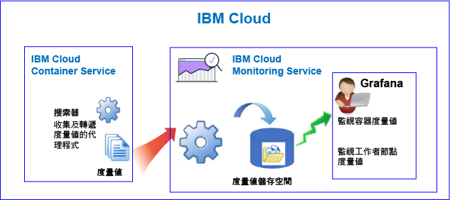
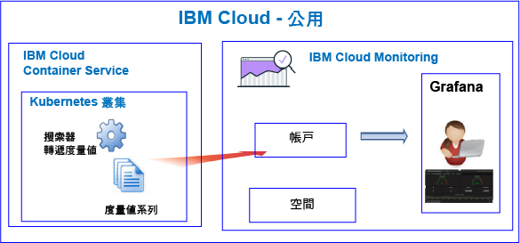
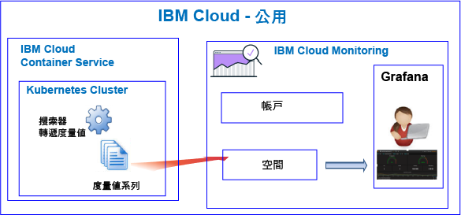
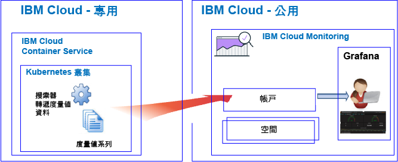

---

copyright:
  years: 2017, 2018

lastupdated: "2018-02-07"

---

{:new_window: target="_blank"}
{:shortdesc: .shortdesc}
{:screen: .screen}
{:pre: .pre}
{:table: .aria-labeledby="caption"}
{:codeblock: .codeblock}
{:tip: .tip}
{:download: .download}

# {{site.data.keyword.containershort_notm}}
{: #monitoring_bmx_containers_ov}

在 {{site.data.keyword.Bluemix}} 中，會自動收集叢集度量值。您可以使用 Grafana 監視叢集效能。
{:shortdesc}

**附註：**透過 {{site.data.keyword.monitoringshort}} 服務可收集及監視標準叢集中所執行容器的度量值。如需標準叢集所支援特性的相關資訊，請參閱[規劃叢集及應用程式](/docs/containers/cs_planning.html#cs_planning_cluster_type)。

## 關於公用中的監視
{: #public}

在 {{site.data.keyword.Bluemix_notm}} 中，您可以使用 {{site.data.keyword.monitoringshort}} 服務，來儲存及分析 {{site.data.keyword.containershort}} 在「公用」中自動收集的容器度量值及 Kubernetes 叢集度量值。

在帳戶中，您可以有一個以上的 Kubernetes 叢集。只要佈建叢集，{{site.data.keyword.containershort}} 就會自動收集度量值。只要部署 Pod，就會收集容器度量值。度量值會自動轉遞至 {{site.data.keyword.monitoringshort}} 服務：

* 當您建立叢集作為帳戶資源時，會將度量值轉遞至 {{site.data.keyword.monitoringshort}} 服務中的帳戶網域。若要將度量值轉遞至帳戶網域，{{site.data.keyword.monitoringshort}} 服務金鑰擁有者必須要有具有 **administrator** 許可權的 IAM 原則，才能使用 {{site.data.keyword.monitoringshort}} 服務。
* 當您建立具有相關聯 Cloud Foundry 空間的叢集時，會將度量值轉遞至 {{site.data.keyword.monitoringshort}} 服務中的空間網域。若要將度量值轉遞至空間網域，{{site.data.keyword.monitoringshort}} 服務金鑰擁有者必須要有組織的 **manager** 角色，以及空間的 **developer** 角色。

下圖顯示 {{site.data.keyword.containershort}} 監視功能的高階視圖：

搜索器是主機中執行的處理程序，並會針對度量值執行無代理程式監視。依預設，搜索器會不斷收集所有容器中的 CPU 及記憶體度量值。

若要在 Grafana 中分析叢集的度量值，請考量下列資訊：

* 您必須在可用來檢視度量值的 {{site.data.keyword.monitoringshort}} 實例佈建所在的「公用」地區中啟動 Grafana。 
* 您可以使用預設 Grafana 儀表板 **ClusterMonitoringDashboard_v1** 來監視叢集。
* 您也可以配置自訂 Grafana 儀表板將叢集的度量值資料視覺化，而叢集位在叢集建立所在的「雲端公用」地區中。
* 您的使用者 ID 必須具有檢視度量值的許可權。 

    若要查看帳戶網域中的度量值，使用者需要有 {{site.data.keyword.monitoringshort}} 服務的 IAM 原則。使用者需要有**檢視器**許可權。 
    
    若要查看空間網域中的度量值，使用者需要 CF 角色。如需相關資訊，請參閱[使用者檢視度量值所需的角色](/docs/services/cloud-monitoring/security_ov.html#bmx_roles)。

### 將度量值轉遞至帳戶網域之叢集的高階監視視圖
{: #acc}

下圖顯示叢集將度量值轉遞至帳戶網域時，{{site.data.keyword.containershort}} 在「公用」中的高階監視視圖：

### 將度量值轉遞至空間網域之叢集的高階監視視圖
{: #space}

下圖顯示叢集將度量值轉遞至空間網域時，{{site.data.keyword.containershort}} 在「公用」中的高階監視視圖：

必須從 Cloud Foundry 組織及空間環境定義的指令行中，建立將度量值轉遞至空間的叢集。建立叢集之前，請執行 `bx target` 指令來設定 CF 組織及空間環境定義。

## 關於專用中的監視
{: #dedicated}

在 {{site.data.keyword.Bluemix_notm}} 中，您可以在「公用」中使用 {{site.data.keyword.monitoringshort}} 服務，來儲存及分析 {{site.data.keyword.containershort}} 在「專用」上自動收集的容器度量值及 Kubernetes 叢集度量值。

在帳戶中，您可以有一個以上的 Kubernetes 叢集。只要佈建叢集，{{site.data.keyword.containershort}} 就會自動收集度量值。只要部署 Pod，就會收集容器度量值。度量值會自動轉遞至 {{site.data.keyword.monitoringshort}} 服務的帳戶網域。

**附註：**若要將度量值轉遞至帳戶網域，{{site.data.keyword.monitoringshort}} 服務金鑰擁有者必須要有具有 **administrator** 許可權的 IAM 原則，才能使用 {{site.data.keyword.monitoringshort}} 服務。

若要在 Grafana 中檢視及分析叢集的度量值，請考量下列資訊：

* 您必須在叢集可於「專用」上使用的「雲端公用」地區中啟動 Grafana。例如，如果在「美國南部」的「專用」上佈建叢集，您必須在「公用」的「美國南部」地區中啟動 Grafana。
* 您可以使用預設 Grafana 儀表板 **ClusterMonitoringDashboard_v1** 來監視叢集。
* 您也可以配置自訂 Grafana 儀表板將叢集的度量值資料視覺化，而叢集位在叢集建立所在的「雲端公用」地區中。
* 您的使用者 ID 必須具有使用 {{site.data.keyword.monitoringshort}} 服務的 IAM 原則。您需要具有**檢視者**許可權，才能查看帳戶網域中的度量值。  

下圖顯示 {{site.data.keyword.containershort}} 在「專用」中的高階監視視圖：

## 容器的 CPU 度量值
{: #cpu_metrics_containers}

下表列出自動為容器擷取的 CPU 度量值：

<table>
  <caption>表 1. 容器的 CPU 度量值</caption>
  <tr>
    <th>度量值名稱</th>
    <th>說明</th>
  </tr>
  <tr>
    <td>*cpu.num-cores*</td>
    <td>此度量值報告容器可用的 CPU 核心數目。  依預設，此度量值報告工作者上的核心數目。如果您對容器可用的核心數目設定限制，則此度量值報告您在該限制中設定的核心數目。</td>
  </tr>
  <tr>
    <td>*cpu.usage*</td>
    <td>此度量值報告所有核心的 CPU 時間（十億分之一秒）。  CPU 用量高時，可能會發生延遲。高 CPU 用量表示處理能力不足。</td>
  </tr>
  <tr>
    <td>*cpu.usage-pct*</td>
    <td>此度量值會報告已使用的 CPU 時間（以 CPU 容量百分比表示）。  依預設，CPU 容量由工作者上的核心數目決定。如果您將限制設定為容器 CPU 容量，則此度量值會將 CPU 用量報告為所設定限制的百分比。CPU 用量百分比高時，可能會發生延遲。高 CPU 用量表示處理能力不足。</td>
  </tr>
  <tr>
    <td>*cpu.usage-pct-container-requested*</td>
    <td>此度量值報告已使用的 CPU 時間（以容器所要求 CPU 的百分比表示）。  如果您未在容器上設定所要求的 CPU，則不會公開容器的這個度量值。</td>
  </tr>
</table>

## 工作者的負載度量值
{: #load_metrics_workers}

下表列出自動為工作者擷取的 CPU 度量值：

<table>
  <caption>表 2. 工作者的負載度量值</caption>
  <tr>
    <th>度量值名稱</th>
    <th>說明</th>
  </tr>
  <tr>
    <td>*load.avg-1*</td>
    <td>此度量值報告過去 1 分鐘內 Kubernetes 主機的平均 CPU 負載。  平均 CPU 負載大於工作者上的核心數目，表示與主機的傳輸置入佇列。</td>
  </tr>
  <tr>
    <td>*load.avg-5*</td>
    <td>此度量值報告過去 5 分鐘內 Kubernetes 主機的平均 CPU 負載。  平均 CPU 負載大於工作者上的核心數目，表示與主機的傳輸置入佇列。</td>
  </tr>
  <tr>
    <td>*load.avg-15*</td>
    <td>此度量值報告過去 15 分鐘內 Kubernetes 主機的平均 CPU 負載。  平均 CPU 負載大於工作者上的核心數目，表示與主機的傳輸置入佇列。</td>
  </tr>
</table>

## 容器的記憶體度量值
{: #memory_metrics}

下表列出自動擷取的記憶體度量值：

<table>
  <caption>表 3. 容器的記憶體度量值</caption>
  <tr>
    <th>度量值名稱</th>
    <th>說明</th>
  </tr>
  <tr>
    <td>*memory.current*</td>
    <td>此度量值會報告容器目前正在使用的記憶體位元組數。</td>
  </tr>
  <tr>
    <td>*memory.limit*</td>
    <td>此度量值報告容許容器交換到磁碟的記憶體數量，而此數量會與針對 Pod 所設定的上限及下限相比較。   依預設，Pod 執行時的記憶體數量無限制。Pod 可以耗用其執行所在工作者節點上的所有記憶體。當您部署 Pod 時，可以設定 Pod 能使用的記憶體數量限制。</td>
  </tr>
  <tr>
    <td>*memory.usage-pct*</td>
    <td>此度量值報告已使用的記憶體（以容器記憶體限制的百分比表示）。   如果您將限制設定為容器可使用的記憶體數量，則此度量值會將記憶體用量報告為所設定限制的百分比。</td>
  </tr>
</table>

## 定義查詢以監視 Kubernetes 叢集中的資源
{: #monitoring_metrics_kube}

若要在 {{site.data.keyword.Bluemix_notm}} 中監視 Kubernetes 叢集中所部署容器及工作者的效能，請使用 Grafana。 

{{site.data.keyword.monitoringlong}} 服務使用 Grafana（一種開放程式碼分析與視覺化平台），可用來以各種圖形（例如圖表和表格）監視、搜尋、分析及視覺化您的度量值。

您可以從瀏覽器啟動 Grafana。如需相關資訊，請參閱[從 Web 瀏覽器導覽至 Grafana 儀表板](/docs/services/cloud-monitoring/grafana/navigating_grafana.html#launch_grafana_from_browser)。

若要監視 Kubernetes 叢集中所執行的容器及工作者，您必須在 Grafana 中定義每個資源的查詢：

* 若要定義查詢以監視容器的 CPU 度量值，請參閱[在 Grafana 中配置容器的 CPU 度量值](/docs/services/cloud-monitoring/containers/config_cpu_worker.html#config_cpu_worker)。
* 若要定義查詢以監視容器的記憶體度量值，請參閱[在 Grafana 中配置容器的記憶體度量值](/docs/services/cloud-monitoring/containers/config_mem_container.html#config_mem_container)。
* 若要定義查詢以監視工作者的「負載」度量值，請參閱[在 Grafana 中配置工作者的負載度量值](/docs/services/cloud-monitoring/containers/config_load_worker.html#config_load_worker)。

查詢的格式會因資源類型及查詢類型而不同：

* 如需監視容器 CPU 之查詢格式的相關資訊，請參閱[容器的 CPU 度量值查詢格式](/docs/services/cloud-monitoring/reference/metrics_format_containers.html#cpu_containers)。 
* 如需監視工作者「負載」之查詢格式的相關資訊，請參閱[工作者的負載度量值查詢格式](/docs/services/cloud-monitoring/reference/metrics_format_containers.html#load_workers)。
* 如需監視容器記憶體之查詢格式的相關資訊，請參閱[容器的記憶體度量值查詢格式](/docs/services/cloud-monitoring/reference/metrics_format_containers.html#mem_containers)。

## 在 {{site.data.keyword.Bluemix_notm}} 中配置自訂防火牆配置的網路資料流量
{: #ports}

如果您已設定其他防火牆，或已在 {{site.data.keyword.Bluemix_notm}} 基礎架構 (SoftLayer) 中自訂防火牆設定，則需要容許從工作者節點到 {{site.data.keyword.monitoringshort}} 服務的送出網路資料流量。 

針對自訂防火牆中的下列 IP 位址，您必須從每一個工作者到 {{site.data.keyword.monitoringshort}} 服務都開啟 TCP 埠 443 及 TCP 埠 9091：

<table>
  <tr>
    <th>地區</th>
    <th>汲取 URL</th>
	<th>公用 IP 位址</th>
  </tr>
  <tr>
    <td>德國</td>
	<td>ingest-eu-fra.logging.bluemix.net</td>
	<td>158.177.88.43  159.122.87.107</td>
  </tr>
  <tr>
    <td>英國</td>
	<td>ingest.logging.eu-gb.bluemix.net</td>
	<td>169.50.115.113</td>
  </tr>
  <tr>
    <td>美國南部</td>
	<td>ingest.logging.ng.bluemix.net</td>
	<td>169.48.79.236  169.46.186.113</td>
  </tr>
  <tr>
    <td>雪梨</td>
	<td>ingest-au-syd.logging.bluemix.net</td>
	<td>130.198.76.125  168.1.209.20</td>
  </tr>
</table>
