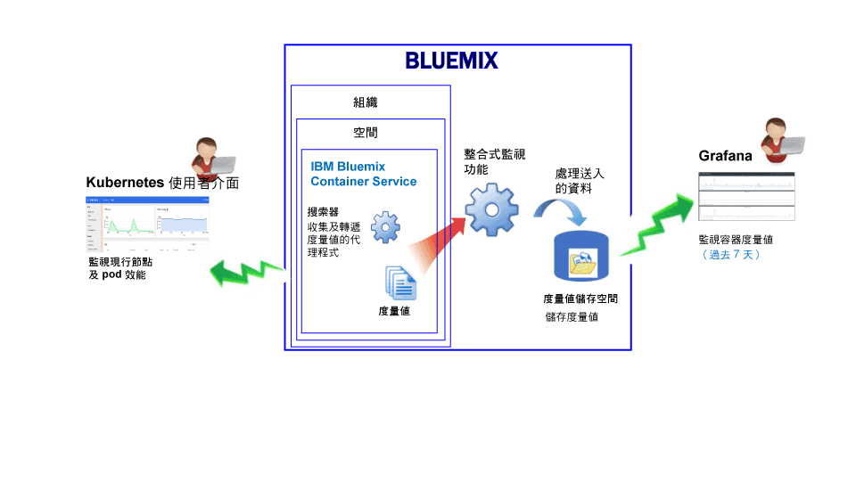

---

copyright:
  years: 2017

lastupdated: "2017-06-21"

---

{:shortdesc: .shortdesc}
{:new_window: target="_blank"}
{:codeblock: .codeblock}
{:screen: .screen}
{:pre: .pre}

# IBM Bluemix Container Service 的監視功能
{: #monitoring_bmx_containers_ov}

在 {{site.data.keyword.Bluemix}} 中，會自動從容器外部收集容器度量值，而不需要在容器內部安裝及維護代理程式。您可以使用 Grafana 來視覺化容器度量值。您也可以使用 Kubernetes 使用者介面來檢視節點（工作者）及 Pod 的度量值。
{:shortdesc}

## 收集在 Kubernetes 叢集中執行之容器的度量值
{: #metrics_containers_kube_ov}

在 {{site.data.keyword.Bluemix_notm}} 中，當您在 Kubernetes 叢集中部署應用程式時，請考量下列資訊：

* 在 {{site.data.keyword.Bluemix_notm}} 帳戶中，您可以有一個以上的組織。
* 每一個組織都可以有一個以上的 {{site.data.keyword.Bluemix_notm}} 空間。
* 在組織中，您可以有一個以上的 Kubernetes 叢集。
* 當您建立 Kubernetes 叢集時，會自動啟用度量值的收集。
* Kubernetes 叢集與 {{site.data.keyword.Bluemix_notm}} 空間無關。不過，針對叢集及其資源所收集的度量值都會與 {{site.data.keyword.Bluemix_notm}} 空間相關聯。
* 一旦部署 Pod，就會收集容器的度量值。
* 您可以在 Grafana 或 Kubernetes 使用者介面中檢視度量值。
* 若要視覺化叢集的度量值資料，您必須為叢集建立所在的「雲端公用」地區配置 Grafana 儀表板。

在您建立叢集之前，必須透過 {{site.data.keyword.Bluemix_notm}} 使用者介面或指令行登入特定 {{site.data.keyword.Bluemix_notm}} 地區、帳戶、組織及空間。您所登入的空間就是收集叢集及其資源度量值資料的空間。

下圖顯示 {{site.data.keyword.containershort}} 監視功能的高階視圖：

搜索器是主機中執行的處理程序，並會針對度量值執行無代理程式監視。依預設，搜索器會不斷從所有容器收集下列度量值：

<table>
  <caption>表 1. 依預設會擷取的度量值</caption>
  <tr>
    <th>度量值類型</th>
    <th>度量值名稱</th>
    <th>說明</th>
  </tr>
  <tr>
    <td>記憶體</td>
    <td>*memory_current*</td>
    <td>此度量值會報告容器目前正在使用的記憶體位元組數。</td>
  </tr>
  <tr>
    <td>記憶體</td>
    <td>*memory_limit*</td>
    <td>此度量值會報告容許容器交換到磁碟的記憶體數量，而此數量會與針對 Pod 所設定的上限及下限相比較。   依預設，Pod 執行時的記憶體數量無限制。Pod 可以耗用其執行所在工作者節點上的所有記憶體。當您部署 Pod 時，可以設定 Pod 能使用的記憶體數量限制。</td>
  </tr>
  <tr>
    <td>CPU</td>
    <td>*cpu_usage*</td>
    <td>此度量值會報告所有核心的 CPU 時間（十億分之一秒）。  CPU 用量高時，可能會發生延遲。高 CPU 用量表示處理能力不足。</td>
  </tr>
  <tr>
    <td>CPU</td>
    <td>*cpu_usage_pct*</td>
    <td>此度量值會報告已使用的 CPU 時間（以 CPU 容量百分比表示）。  CPU 用量百分比高時，可能會發生延遲。高 CPU 用量表示處理能力不足。</td>
  </tr>
  <tr>
    <td>CPU</td>
    <td>*cpu_num_cores*</td>
    <td>此度量值會報告容器可用的 CPU 核心數目。</td>
  </tr>
</table>

## 收集 Bluemix 中所管理容器的預設度量值
{: #metrics_containers_bmx_ov}

下圖顯示 {{site.data.keyword.containershort}} 監視功能的高階視圖：

依預設，搜索器會不斷從所有容器收集下列度量值：

* CPU
* 記憶體
* 網路資訊

## 監視在 Kubernetes 叢集中執行之容器的度量值
{: #monitoring_metrics_kube}

度量值會收集並同時顯示在 Kubernetes 使用者介面及 Grafana 中：

* 使用 Grafana（一種開放程式碼分析與視覺化平台），在各種圖形（例如圖表和表格）中監視、搜尋、分析及視覺化您的度量值。
 
    您可以從瀏覽器啟動 Grafana。如需相關資訊，請參閱[從 Web 瀏覽器導覽至 Grafana 儀表板](/docs/services/cloud-monitoring/grafana/navigating_grafana.html#launch_grafana_from_browser)。
    
* 使用 Kubernetes 使用者介面來檢視節點及 Pod 的度量值。如需相關資訊，請參閱 [Web 使用者介面儀表板 ](https://kubernetes.io/docs/tasks/access-application-cluster/web-ui-dashboard/ "外部鏈結圖示"){: new_window}。

## 監視 Bluemix 中所管理容器的度量值
{: #monitoring_metrics_bmx}

度量值會收集並同時顯示在 {{site.data.keyword.Bluemix_notm}} 使用者介面及 Grafana 中：

* 使用 Grafana（一種開放程式碼分析與視覺化平台），在各種圖形（例如圖表和表格）中監視、搜尋、分析及視覺化您的度量值。
 
    您可以從 {{site.data.keyword.Bluemix_notm}} 使用者介面或瀏覽器啟動 Kibana。如需相關資訊，請參閱[導覽至 Grafana 儀表板](/docs/services/cloud-monitoring/grafana/navigating_grafana.html#navigating_grafana)。
    

* 使用 {{site.data.keyword.Bluemix_notm}} 使用者介面來檢視最新的度量值。

    若要在 {{site.data.keyword.Bluemix_notm}} 使用者介面中檢視度量值，請參閱[從 Bluemix 主控台分析度量值](/docs/services/cloud-monitoring/containers/analyzing_metrics_bmx_ui.html#analyzing_metrics_bmx_ui)。

    

