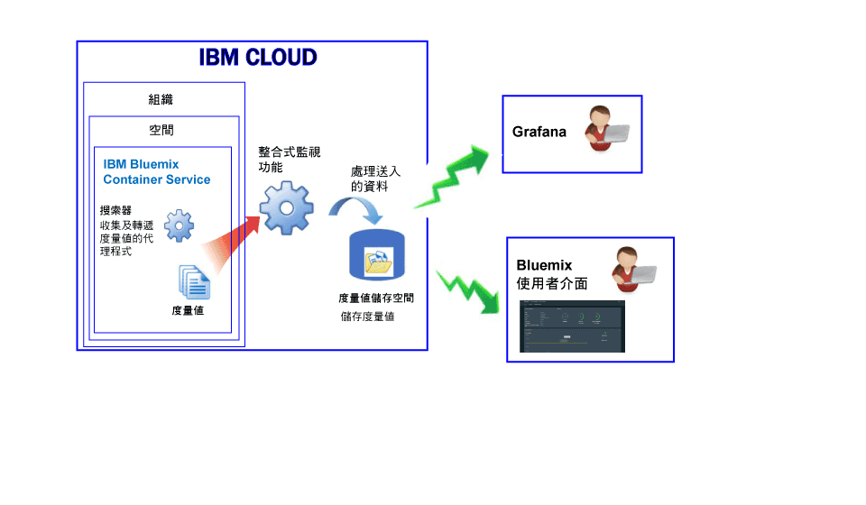

---

copyright:
  years: 2017, 2018

lastupdated: "2018-02-02"

---

{:new_window: target="_blank"}
{:shortdesc: .shortdesc}
{:screen: .screen}
{:pre: .pre}
{:table: .aria-labeledby="caption"}
{:codeblock: .codeblock}
{:tip: .tip}
{:download: .download}

# IBM Cloud 中所管理的容器（已淘汰）
{: #monitoring_managed_containers_ov}

在 {{site.data.keyword.Bluemix}} 中，會自動從容器外部收集容器及工作者度量值，而不需要在容器內部安裝及維護代理程式。您可以使用 Grafana 將容器度量值視覺化。
{:shortdesc}

**附註：**透過 {{site.data.keyword.monitoringshort}} 服務可收集及監視標準叢集中所執行容器的度量值。如需標準叢集所支援特性的相關資訊，請參閱[規劃叢集及應用程式](/docs/containers/cs_planning.html#cs_planning_cluster_type)。

## 收集預設度量值
{: #metrics_containers_bmx_ov}

下圖顯示 {{site.data.keyword.containershort}} 監視功能的高階視圖：

依預設，搜索器會不斷從所有容器收集下列度量值：

* CPU
* 記憶體
* 網路資訊

## 監視 IBM Cloud 中所管理容器的度量值（已淘汰）
{: #monitoring_metrics_bmx}

度量值會收集並同時顯示在 {{site.data.keyword.Bluemix_notm}} 使用者介面及 Grafana 中：

* 使用 Grafana（一種開放程式碼分析與視覺化平台），在各種圖形（例如圖表和表格）中監視、搜尋、分析及視覺化您的度量值。

    您可以從 {{site.data.keyword.Bluemix_notm}} 使用者介面或瀏覽器啟動 Kibana。如需相關資訊，請參閱[導覽至 Grafana 儀表板](/docs/services/cloud-monitoring/grafana/navigating_grafana.html#navigating_grafana)。

* 使用 {{site.data.keyword.Bluemix_notm}} 使用者介面來檢視最新的度量值。

    若要在 {{site.data.keyword.Bluemix_notm}} 使用者介面中檢視度量值，請參閱[從 {{site.data.keyword.Bluemix_notm}} 主控台分析度量值](/docs/services/cloud-monitoring/containers/analyzing_metrics_bmx_ui.html#analyzing_metrics_bmx_ui)。
