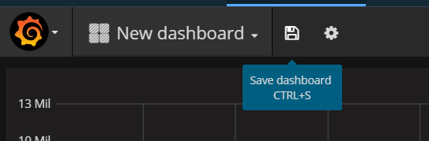

---

copyright:
  years: 2017
lastupdated: "2017-06-26"

---

{:new_window: target="_blank"}
{:shortdesc: .shortdesc}
{:screen: .screen}
{:codeblock: .codeblock}
{:pre: .pre}

# 開始使用 Bluemix 中的 IBM Cloud Monitoring
{: #getting-started-with-ibm-cloud-monitoring}

在此開始使用指導教學中，我們會逐步引導您使用 {{site.data.keyword.monitoringlong}} 服務來分析容器。學習如何搜尋及分析 Kubernetes 叢集中所部署應用程式的容器度量值。
{:shortdesc}

## 開始之前
{: #prereqs}

建立 [Bluemix 帳戶](https://console.bluemix.net/registration/)。您的使用者 ID 必須是 Bluemix 帳戶的成員或擁有者，並具有許可權可以建立 Kubernetes 叢集、將應用程式部署至叢集，以及查詢 Bluemix 中的日誌以在 Kibana 中進行進階分析。

開啟終端機階段作業，您可以從中管理 Kubernetes 叢集，並從指令行部署應用程式。此指導教學中提供的範例適用於 Ubuntu Linux 系統。

在本端環境中[安裝 CLI 外掛程式](/docs/containers/cs_cli_install.html#cs_cli_install_steps)，以從指令行管理 IBM Bluemix Container Service。 


## 步驟 1：在容器中部署應用程式
{: #step1}

請完成下列步驟，以在 Kubernetes 叢集中部署容器：

1. [建立 Kubernetes 叢集](/docs/containers/cs_cluster.html#cs_cluster_ui)。

2. 在 Linux 終端機中，[設定叢集環境定義](/docs/containers/cs_cli_install.html#cs_cli_configure)。設定環境定義之後，您可以管理 Kubernetes 叢集，並在 Kubernetes 叢集中部署應用程式。

3. 在 Kubernetes 叢集中部署及執行範例應用程式。[完成課程 1 的步驟](/docs/containers/cs_tutorials.html#cs_apps_tutorial)。

    應用程式是 Hello World Node.js 應用程式：

    ```
    var express = require('express')
    var app = express()

    app.get('/', function(req, res) {
      res.send('Hello world! Your app is up and running in a cluster!\n')
    })
    app.listen(8080, function() {
      console.log('Sample app is listening on port 8080.')
    })
    ```

    部署應用程式後，度量值收集便會自動啟用。


## 步驟 2：導覽至 Grafana 儀表板
{: #step2}

從瀏覽器啟動 Grafana。 

若要分析叢集的度量值，您必須在叢集建立所在的雲端「公用」地區中存取 Grafana。 
    
然後，從瀏覽器啟動下列 URL 以開啟 Grafana：`https://metrics.ng.bluemix.net/`
    
    
## 步驟 3：在 Grafana 中分析度量值
{: #step3}

請完成下列步驟，以建立 Grafana 儀表板：
    
1. 建立新的儀表板。

    * 選取側邊功能表列切換 。 
    * 選取**儀表板**。 
    * 按一下**新建**。
    
    即會開啟儀表板。儀表板包括已備妥可進行配置的空白列。 
    
    
    
     在 Grafana 中，您可以新增幾列，將儀表板區分為數個區段。一列集合了 1 個以上的畫面。在一列中，畫面是您可配置以顯示度量值資料的最小視覺效果單位，例如，您可以選擇圖形畫面或表格畫面。您可以拖放畫面，以重新排列儀表板中的畫面。畫面顯示的資料是透過查詢而配置。您可以在一個畫面中定義一個以上的查詢。每一個查詢都代表不同的資料集。您也可以設定畫面的時間範圍。通常，時間範圍是由*儀表板* 時間選取器所設定。
    
2. 新增*圖形* 畫面，以監視容器的所有核心的 CPU 時間（十億分之一秒）。
    
    1. 選取**圖形**。
    
    2. 按一下圖形標題，然後選取**編輯**。
    
        即會開啟*度量值* 標籤。您可以在這裡看到預設資料來源。
    
        
    
3. 定義過濾圖形中所顯示資料的查詢。 

    下表概述不同的必要欄位，用來配置過濾容器度量值資料的查詢：

    <table>
      <caption>表 1. 容器的 Grafana 查詢欄位</caption>
      <tr>
        <th align="center">欄位</th>
        <th align="center">說明</th>
        <th align="center">有效值</th>
      </tr>
      <tr>
        <td>字首</td>
        <td>容器度量值的字首。<br><br>此字首適用於針對 Kubernetes 叢集中所部署容器而收集的資料。</td>
        <td>`crn`</td>
      </tr>
      <tr>
        <td>版本</td>
        <td>所收集度量值資料的版本。</td>
        <td>`v1`</td>
      </tr>
      <tr>
        <td>提供者</td>
        <td>收集其中資料的雲端提供者。</td>
        <td>`bluemix`</td>
      </tr>
      <tr>
        <td>類型</td>
        <td>收集其中資料的雲端環境。</td>
        <td>`public`</td>
      </tr>
      <tr>
        <td>來源</td>
        <td>在其中收集度量值的雲端基礎架構。</td>
        <td>`containers-kubernetes`</td>
      </tr>
      <tr>
        <td>地區</td>
        <td>在其中收集度量值的雲端地區。</td>
        <td>* `ng` <br>* `eu-gb` <br>* `eu-de` </td>
      </tr>
      <tr>
        <td>帳戶</td>
        <td>在其中收集度量值之帳戶的 GUID。<br>此欄位的格式如下：`a_*ID*`，其中 ID 是帳戶的 GUID。</td>
        <td></td>
      </tr>
      <tr>
        <td>叢集</td>
        <td>在其中收集度量值之叢集的 GUID。</td>
        <td></td>
      </tr>
      <tr>
        <td>容器度量值</td>
        <td>針對容器所收集的度量值。</td>
        <td>* `memory_current` <br>* `memory_limit` <br>* `cpu_usage` <br>* `cpu_usage_pct` <br>* `cpu_num_cores`</td>
      </tr>
      <tr>
        <td>POD 中的容器</td>
        <td>Kubernetes 資源名稱及 GUID 的組合，需有此組合，才能專門識別 POD 中執行的容器。<br> 此欄位的格式如下：*{namespace}_#{pod_name}_#{container_name}_#{container_id}* <br><br>**附註：**當您查看此項目可在查詢中使用的選項清單時，請注意，也有項目具有下列格式：*{namespace}_#{pod_name}_#{container_name}_POD_#{container_id}*。此項目對應於 Kubernetes 所建立的內部容器 ID。</td>
        <td></td>
      </tr>
      <tr>
        <td>函數</td>
        <td>您可以選取以視覺化畫面中之容器度量值的查詢函數。<br>如需相關資訊，請參閱[函數 ](http://graphite.readthedocs.io/en/latest/functions.html "外部鏈結圖示"){: new_window}</td>
        <td></td>
      </tr>
    </table>
    
    下圖顯示在配置查詢後，該查詢在 Grafana 中的顯示情形：
    
    
    
    請完成下列步驟，以定義查詢：
    
    在*度量值* 標籤中，選取**新增查詢**。<br>即會新增查詢項目。每一個查詢都會以一個字母標示。
    
    
        
    1. 按一下**選取度量值**，然後選擇 `crn`。
    
    2. 按一下**選取度量值**，然後選擇 `v1`。
    
    3. 按一下**選取度量值**，然後選擇 `bluemix`。
    
    4. 按一下**選取度量值**，然後選擇 `public`。
    
    5. 按一下**選取度量值**，然後選擇 `containers-kubernetes`。
    
    6. 按一下**選取度量值**，然後選擇您工作的地區，例如，`us-south`。
    
    7. 按一下**選取度量值**，然後選擇您要顯示其資料的帳戶 ID，例如，`a_91d1d1exxxxxxx4df920bbd06461b066`。
    
    8. 按一下**選取度量值**，然後選擇「叢集 ID」。
    
    9. 按一下**選取度量值**，然後選擇容器度量值。若要監視容器的 *CPU 用量*，請選擇 `container-metric-cpu_usage`。
    
    10. 按一下**選取度量值**，然後選擇對應於您要監視其 CPU 用量的容器 ID，例如，`default_hello-world-deployment-3355293961-0fwkg_hello-world-deployment_ad5eb446a493db31f1d9eb158f5de915fc063d6c136823488b694e63bb00aa57`。
    
    11. 按一下加號影像 ，然後選擇函數。您可以新增函數，以在可供度量值使用的資料上轉換、結合及執行運算。
        
        例如，您可以新增 **alias(newName)** 函數來新增度量值的別名。此別名用來列印字串，而不是圖形中所顯示圖註中的度量值名稱。
        
        若要新增度量值的別名，請完成下列步驟：
        
        1. 按一下加號。
        2. 選取**特殊**。
        3. 選取**別名**。
        4. 輸入字串，例如，`My sample metric`。
        
4. 儲存儀表板，以供稍後重複使用。 

    1. 按一下儲存儀表板影像 。 
    
        
    
    2. 輸入儀表板的名稱。
    3. 按一下**儲存**。


## 後續步驟
{: #next_steps}

定義度量值的警示。如需相關資訊，請參閱[配置警示](/docs/services/cloud-monitoring/config_alerts_ov.html#config_alerts_ov)。


