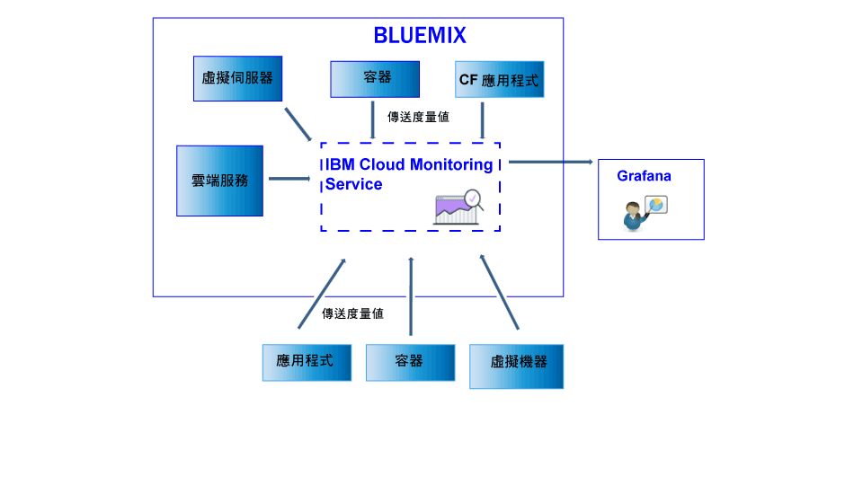

---

copyright:
  years: 2017

lastupdated: "2017-07-10"

---

{:shortdesc: .shortdesc}
{:new_window: target="_blank"}
{:codeblock: .codeblock}
{:screen: .screen}
{:pre: .pre}

# 傳送及擷取資料
{: #send_retrieve_metrics_ov}

您可以使用「度量值 API」，將度量值從 {{site.data.keyword.Bluemix}} 空間傳送並擷取至 {{site.data.keyword.monitoringshort}} 服務。
{:shortdesc}

下圖顯示不同資源的高階視圖，您可以從這些資源將度量值傳送至 {{site.data.keyword.monitoringshort}} 服務：

## 傳送度量值
{: #send}

若為 {{site.data.keyword.Bluemix_notm}} Docker 容器，會自動收集基本系統度量值。若為 Cloud Foundry 應用程式及「虛擬機器 (VM)」中執行的應用程式，則必須使用「度量值 API」，直接從應用程式傳送度量值。 

若要將度量值傳送至 {{site.data.keyword.monitoringshort}} 服務，請考量下列資訊： 

* 您必須設定您要從中擷取資料的 {{site.data.keyword.Bluemix_notm}} 空間。

* 您必須提供安全記號或 API 金鑰，以便使用 {{site.data.keyword.monitoringshort}} 服務。 

* 您可以使用 API 端點 `https://metrics.ng.bluemix.net/v1/metrics`。如需 API 的相關資訊，請參閱[度量值 API](https://console.bluemix.net/apidocs/927-ibm-cloud-monitoring-rest-api?&language=node#introduction){: new_window}。

視您選擇的鑑別模型而定，選擇下列其中一個選項，將資料傳送至 {{site.data.keyword.monitoringshort}} 服務：
 
* 若要使用 UAA 記號傳送度量值，請參閱[使用 UAA 將度量值傳送至空間](/docs/services/cloud-monitoring/send-metrics/send_data_api.html#uaa)。

* 若要使用 IAM 記號或 API 金鑰傳送度量值，請參閱[使用 IAM 或 API 金鑰將度量值傳送至空間](/docs/services/cloud-monitoring/send-metrics/send_data_api.html#iam)。

## 擷取度量值
{: #retrieve}

若要擷取度量值，請考量下列資訊： 

* 您必須設定您要從中擷取資料的 {{site.data.keyword.Bluemix_notm}} 空間。

* 您必須提供安全記號或 API 金鑰，以便使用 {{site.data.keyword.monitoringshort}} 服務。 

* 您必須指定一個以上度量值的路徑。如需相關資訊，請參閱[定義度量值](/docs/services/cloud-monitoring/retrieve-metrics/retrieve_data_api.html#metrics)。

* 您可以選擇性地指定自訂的時段。依預設，如果沒有指定時段，則您擷取的資料是對應於過去 24 小時的資料。如需相關資訊，請參閱[配置時段](/docs/services/cloud-monitoring/retrieve-metrics/retrieve_data_api.html#time)。

* 您可以使用 API 端點 `https://metrics.ng.bluemix.net/v1/metrics`。如需 API 的相關資訊，請參閱[度量值 API](https://console.bluemix.net/apidocs/927-ibm-cloud-monitoring-rest-api?&language=node#introduction){: new_window}。

**附註：**每個要求最多可以擷取 5 個目標。

視您選擇的鑑別模型而定，選擇下列其中一個選項，從 {{site.data.keyword.monitoringshort}} 服務擷取資料：
 
* 若要使用 UAA 記號擷取度量值，請參閱[使用 UAA 將度量值擷取至空間](/docs/services/cloud-monitoring/retrieve-metrics/retrieve_data_api.html#uaa)。

* 若要使用 IAM 記號或 API 金鑰擷取度量值，請參閱[使用 IAM 或 API 金鑰將度量值擷取至空間](/docs/services/cloud-monitoring/retrieve-metrics/retrieve_data_api.html#iam)。

## 擷取度量值清單
{: #show_metrics}

您可以列出空間中可用的度量值。

若要列出度量值，請考量下列資訊： 

* 您必須設定要列出其可用度量值的 {{site.data.keyword.Bluemix_notm}} 空間。

* 您必須提供安全記號或 API 金鑰，以便使用 {{site.data.keyword.monitoringshort}} 服務。 

* 您必須指定查詢，以定義列出度量值的來源路徑。例如，若要列出空間中的所有度量值，您可以將查詢設為：`query=SpaceGUID.*` 其中 *SpaceGUID* 是空間的 GUID。

    預設值是 `*`，它將起點指定為空間的根層次。

* 您可以使用 API 端點 `https://metrics.ng.bluemix.net/v1/metrics/list`。如需 API 的相關資訊，請參閱[度量值 API](https://console.bluemix.net/apidocs/927-ibm-cloud-monitoring-rest-api?&language=node#introduction){: new_window}。

 
