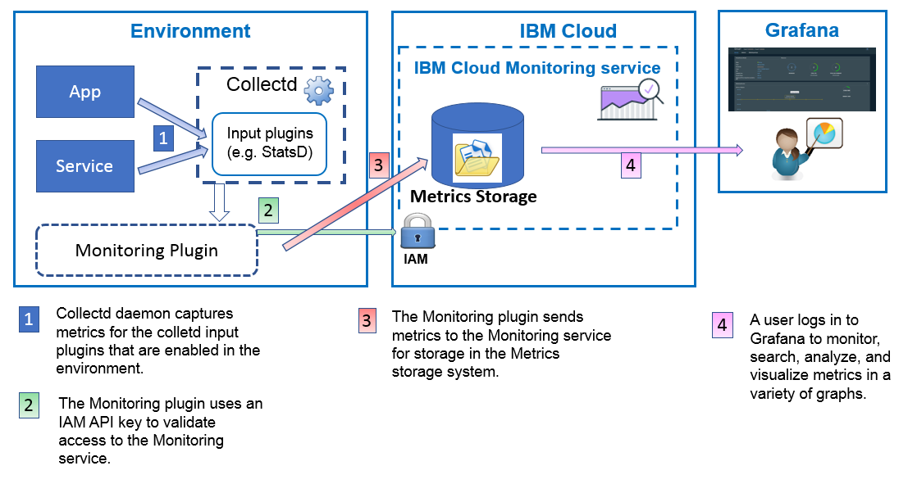

---

copyright:
  years: 2017, 2018

lastupdated: "2018-02-01"

---

{:new_window: target="_blank"}
{:shortdesc: .shortdesc}
{:screen: .screen}
{:pre: .pre}
{:table: .aria-labeledby="caption"}
{:codeblock: .codeblock}
{:tip: .tip}
{:download: .download}

# Sending data by using the Monitoring plugin (collectd)
{: #conf_monitoring_plugin}

You can configure collectd to collect metrics in an environment. Use the {{site.data.keyword.monitoringshort}} plugin to send these metrics to a space domain from your environment. 
{: shortdesc}

The following figure shows a high level view of how to use the {{site.data.keyword.monitoringshort}} plugin to send metrics into the {{site.data.keyword.monitoringshort}} service:




## Install the Monitoring plugin
{: #install}

From a terminal, complete the following steps: 

1. (Pre-req) Install the {{site.data.keyword.Bluemix_notm}} CLI.

   For more information, see [Installing the {{site.data.keyword.Bluemix_notm}} CLI](/docs/services/cloud-monitoring/qa/cli_qa.html#cli_qa).
   
   If the CLI is installed, continue with the next step.
	
2. Log in to a region, organization, and space in the {{site.data.keyword.Bluemix_notm}}. 

    For more information, see [How do I log in to the {{site.data.keyword.Bluemix_notm}}](/docs/services/cloud-monitoring/qa/cli_qa.html#login).

    For example, to log in to the US South region, run the following command:
	
	```
    bx login -a https://api.ng.bluemix.net
	bx target -o MyOrg -s MySpace
    ```
    {: codeblock}

    Follow the instructions. Enter your {{site.data.keyword.Bluemix_notm}} credentials, select an organization and a space.

### Step 1: Install collectd
{: #collectd}

As an admin, complete the following steps to install collectd:

1.	Log in as the root user. 

    ```
    sudo -s
    ```
    {: codeblock}

2.	Install the Network Time Protocol (NTP) package to synchronize the time of the logs. 

    For example, for an Ubunutu system, chek if `timedatectl status` shows *Network time on: yes*. If it does, your Ubuntu system is already configured to use ntp and you can skip this step.
    
    ```
    # timedatectl status
    Local time: Mon 2017-06-12 03:01:22 PDT
    Universal time: Mon 2017-06-12 10:01:22 UTC
    RTC time: Mon 2017-06-12 10:01:22
    Time zone: America/Los_Angeles (PDT, -0700)
    Network time on: yes
    NTP synchronized: yes
    RTC in local TZ: no
    ```
    {: screen}
    
    Complete the following steps to install ntp in an Ubuntu system:

    1.	Run the following command to update the packages. 

        ```
        apt-get update
        ```
        {: codeblock}
        
    2.	Run the following command to install the ntp package. 

        ```
        apt-get install ntp
        ```
        {: codeblock}
        
    3.	Run the following command to install the ntpdate package. 
    
        ```
        apt-get install ntpdate
        ```
        {: codeblock}
        
    4.	Run the following command to stop the service 
        
        ```
        service ntp stop
        ```
        {: codeblock}
        
    5.	Run the following command to synchronize the system clock. 
    
        ```
        ntpdate -u 0.ubuntu.pool.ntp.org
        ```
        {: codeblock}
        
        The result confirms that the time is adjusted, for example:
        
        ```
        4 May 19:02:17 ntpdate[5732]: adjust time server 50.116.55.65 offset 0.000685 sec
        ```
        {: screen}
        
    6.	Run the following command to start ntpd again. 
    
        ```
        service ntp start
        ```
        {: codeblock}
    
        The result confirms that the service is starting.

3. Install collectd. Run the following command:

    ```
	apt-get install collectd 
	```
	{: codeblock}


### Step 2: Install the Monitoring plugin
{: #plugin}

Complete the following steps to install the {{site.data.keyword.monitoringshort}} plugin:

1. 	Log in as the root user. 

    ```
    sudo -s
    ```
    {: codeblock}
	
2. Add the {{site.data.keyword.monitoringshort}} service repository. Run the following command:

    ```
    wget -O - https://downloads.opvis.bluemix.net/client/IBM_Logmet_repo_install.sh | bash
    ```
   {: codeblock}
   
3. Install the plugin. Run the following command:

    ```
	apt-get install ibmcloud-monitoring
	```
	{: codeblock}


## Configure the Monitoring plugin
{: #configure}

To configure the {{site.data.keyword.monitoringshort}} plugin, complete the following steps:
	
### Step 1: Assign an IAM policy to the user
{: #iam_policy}

To send metrics into any domain, your user ID must be granted an IAM role with permissions to send metrics into the Monitoring service.
 
* Permissions are set by assigning an IAM policy for that user in the IBM Cloud. 
* The following IAM roles allow a user to send metrics: *Administrator*, *Editor*, *Operator*. 

To assign a user an IAM policy, choose one of the following methods:

* Through the {{site.data.keyword.Bluemix_notm}} UI: For more information, see [Assigning a user an IAM policy through the {{site.data.keyword.Bluemix_notm}} UI ](/docs/services/cloud-monitoring/security/assign_policy.html#assign_policy_ui).
* By using the command line: For more information, see [Assigning a user an IAM policy by using the command line ](/docs/services/cloud-monitoring/security/assign_policy.html#assign_policy_commandline).
 
### Step 2: Get an API key
{: #api_key}
 
To send metrics into a space, you must get an API key to authenticate with the {{site.data.keyword.monitoringshort}} service.

For more information on how to get an API key, see [Getting an API key](/docs/services/cloud-monitoring/security/auth_api_key.html#auth_api_key).
	
From the same terminal where you logged in to the {{site.data.keyword.Bluemix_notm}}, set the APIKEY variable for the token.

For example,

```
export APIKEY="kjshdgf.....ldkdjdj"
```
{: screen}
	
### Step 3: Get information about the endpoint
{: #endpoint}

To determine the {{site.data.keyword.monitoringshort}} endpoint where you are going to send the metrics, see the list of endpoints per region, see [Endpoints](/docs/services/cloud-monitoring/send_retrieve_metrics_ov.html#endpoints), and identify the one for the region where you want to send metrics.

From the same terminal where you logged in to the {{site.data.keyword.Bluemix_notm}}, set the **METRIC_ENDPOINT** variable. For example,

```
export METRIC_ENDPOINT="metrics.ng.bluemix.net"
```
{: screen}


### Step 4: Get information about the space domain ID 
{: #domain}

To get the domain ID for a space, [get the space GUID](/docs/services/cloud-monitoring/qa/cli_qa.html#space_guid). Then, set the domain ID as follows: `s-SpaceID` where SpaceID is the GUID of the space.

From the same terminal where you logged in to the {{site.data.keyword.Bluemix_notm}}, set the SpaceID variable:

```
export SpaceID="kjshdgf.....ldkdjdj"
```
{: screen}


### Step 5: Run the configuration script
{: #script}

Run the following script to configure the {{site.data.keyword.monitoringshort}} plugin to send metrics to a space:

```
/opt/ibmcloud_monitoring/configure -e $METRIC_ENDPOINT -a $APIKEY -s s-$SpaceID
```
{: codeblock}


The script automatically adds the **Include** stanza into the main collectd.conf file:

```
<LoadPlugin IBMCloudMonitoring>
   FlushInterval 60
</LoadPlugin>
<Plugin IBMCloudMonitoring>
  <Endpoint "ng">
     Host "metrics.ng.bluemix.net"
     Port 9095
     ApiKey "xxxxxxxxxxxxxxxxxxxxxxxxxxxxxxxxxxxxxxxx"
     SkipInternalPrefixForStatsd false
     RateCounter false
     ScopeId "s-cedc73c5-6d55-4193-a9de-378620d6fab5"
  </Endpoint>
</Plugin>
```
{: screen}


### Step 6: Restart the collectd daemon
{: #restart}

Complete the following steps:

1. 	Log in as the root user. 

    ```
    sudo -s
    ```
    {: codeblock}
	
2.  Restart collectd.

   If the collectd daemon was added as a service, run the following command:
	
	```
	service collectd restart
	```
	{: codeblock}

The metrics that are enabled in collectd are the ones that are available for analysis in Grafana.


