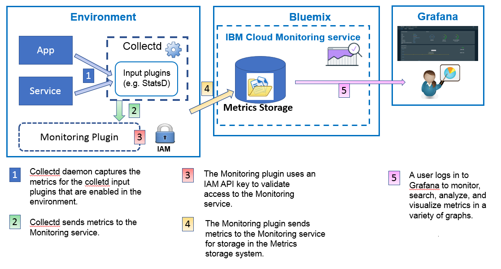

---

copyright:
  years: 2017, 2018

lastupdated: "2018-02-01"

---

{:new_window: target="_blank"}
{:shortdesc: .shortdesc}
{:screen: .screen}
{:pre: .pre}
{:table: .aria-labeledby="caption"}
{:codeblock: .codeblock}
{:tip: .tip}
{:download: .download}

# Sending and retrieving data
{: #send_retrieve_metrics_ov}

You can send metrics to a space by using the Metrics API, or by configuring the {{site.data.keyword.monitoringshort}} plugin, which is a collectd plugin. You can retrieve metrics by using the Metrics API.
{:shortdesc}

		
## Sending metrics
{: #send}

The following figure shows a high level view of the different data sources from where you can send metrics to the {{site.data.keyword.monitoringshort}} service:

For containers that run in a Kubernetes cluster in {{site.data.keyword.Bluemix_notm}}, and for selected services, basic system metrics are automatically collected. 
You can also collect more metrics, or send metrics from ouside the {{site.data.keyword.IBM_notm}} Cloud, into the {{site.data.keyword.monitoringshort}} service. Different methods are available. The following tables list the methods by metrics source:

<table>
  <caption>Table 1. Methods to send metrics to the {{site.data.keyword.monitoringshort}} service for {{site.data.keyword.IBM_notm}} Cloud resources.</caption>
  <tr>
    <th>Metrics Source</th>
	<th>Metrics API</th>
    <th>{{site.data.keyword.monitoringshort}} Plugin (collectd)</th>	
	<th>More info</th>
  </tr>
  <tr>
    <td>Containers that run in a Kubernetes cluster in the {{site.data.keyword.Bluemix_notm}}</td>
	<td>Yes</td>
	<td>Yes</td>
	<td>Basic system metrics are automatically collected automatically. You can install collectd explicitly and send advanced or custom metrics that are not provided by default.</td>
  </tr>
  <tr>
    <td>Cloud Foundry Applications</td>
	<td>Yes</td>
	<td>No</td>
	<td></td>
  </tr>
  <tr>
    <td>Virtual Servers </td>
	<td>Yes</td>
	<td>Yes</td>
	<td>**Note:** Not supported for Windows.</td>
  </tr>
</table>

<table>
  <caption>Table 2. Methods to send metrics to the {{site.data.keyword.monitoringshort}} service from outside the {{site.data.keyword.IBM_notm}} Cloud.</caption>
  <tr>
    <th>Metrics Source</th>
	<th>Metrics API</th>
    <th>{{site.data.keyword.monitoringshort}} Plugin (collectd)</th>	
	<th>More info</th>
  </tr>
  <tr>
    <td>Containers</td>
	<td>Yes</td>
	<td>Yes</td>
	<td>You can use *supervisord* as container endpoint to run and manage both your app and collectd.</td>
  </tr>
  <tr>
    <td>Applications</td>
	<td>Yes</td>
	<td>No</td>
	<td></td>
  </tr>
  <tr>
    <td>Services</td>
	<td>Yes</td>
	<td>No</td>
	<td></td>
  </tr>
  <tr>
    <td>Virtual Machines (VM)</td>
	<td>Yes</td>
	<td>Yes</td>
	<td>**Note:** Not supported for Windows.</td>
  </tr>
</table>

To send metrics into the {{site.data.keyword.monitoringshort}} service, consider the following information: 

* You must specify the space where you want to send metrics.

* You must provide a security token or API key to work with the {{site.data.keyword.monitoringshort}} service. 

* The {{site.data.keyword.IBM_notm}}ID of the user that sends metrics must have an IAM policy assigned for the {{site.data.keyword.monitoringshort}} service. The following IAM roles allow a user to send metrics: *Administrator*, *Editor*, and *Operator*.

* You must specify the API endpoint where you are sending metrics. There is one endpoint per region. For example, for the US South region, the endpoint is the following: `https://metrics.ng.bluemix.net/v1/metrics`. For more information about the endpoints, see [URLs for the {{site.data.keyword.monitoringshort}} service](/docs/services/cloud-monitoring/monitoring_ov.html#region){: new_window}.

You can send metrics to the {{site.data.keyword.monitoringshort}} service by using any of the following methods:

* *Method 1: Configure the {{site.data.keyword.monitoringshort}} plugin.*

    For more information, see [Configuring the {{site.data.keyword.monitoringshort}} plugin](/docs/services/cloud-monitoring/send-metrics/conf_monitoring_plugin.html#conf_monitoring_plugin).

    The following figure shows a high level view of how to use the {{site.data.keyword.monitoringshort}} plugin to send metrics into the {{site.data.keyword.monitoringshort}} service:

    

* *Method 2: Use the Metrics API.*

    For more information, see [Sending metrics by using the Metrics API](/docs/services/cloud-monitoring/send-metrics/send_data_api.html#send_data_api).

## Retrieving metrics
{: #retrieve}

If you need to do further analysis outside of the {{site.data.keyword.monitoringshort}} service, or if your application wants to use metrics to make decisions, you can use the Metrics API to retrieve a maximum of five metrics per request. 

* For more information on how to retrieve metrics, see [Retrieving metrics from a domain](/docs/services/cloud-monitoring/retrieve-metrics/retrieve_data_api.html#retrieve_data_api)
* For more information about the Metrics API, see [Metrics API](https://console.bluemix.net/apidocs/927-ibm-cloud-monitoring-rest-api?&language=node#introduction){: new_window}.

To retrieve metrics, consider the following information: 

* You must set the space from where you want to retrieve the data. 
* You must provide a security token or API key to work with the {{site.data.keyword.monitoringshort}} service. 
* You must specify a path to 1 or more metrics. For more information, see [Defining the metrics](/docs/services/cloud-monitoring/retrieve-metrics/retrieve_data_api.html#metrics).
* Optionally, you can specify a custom time period. By default, if you do not specify a time period, the data that you retrieve is the data that corresponds to the last 24 hours. For more information, see [Configuring a period of time](/docs/services/cloud-monitoring/retrieve-metrics/retrieve_data_api.html#time).

## Listing metrics
{: #show_metrics}

You can list the metrics that are available in a space.

To list the metrics, consider the following information: 

* You must set the {{site.data.keyword.Bluemix_notm}} space for which you want to list the metrics that are available.

* You must provide a security token or API key to work with the {{site.data.keyword.monitoringshort}} service. 

* You must specify a query that defines the path from where to list the metrics. For example, to list all the metrics in a space, you can set the query to: `query=*` 

    The default is `*` which specifies the start point at the root level for the space.
	
* You can use the API call `Endpoint/v1/metrics/list` where Endpoint represents the entry point to the service. 

    Each region has a different URL. For example, for the US South region, you can use the API endpoint `https://metrics.ng.bluemix.net/v1/metrics/list` 

    To get the list of endpoints per region, see [Endpoints](/docs/services/cloud-monitoring/send_retrieve_metrics_ov.html#endpoints).

    For more information about the API, see [the Metrics API](https://console.bluemix.net/apidocs/927-ibm-cloud-monitoring-rest-api?&language=node#introduction){: new_window}.

## Endpoints to send metrics
{: #endpoints}

 The following table lists the endpoints by region:
	
<table>
    <caption>List of endpoints</caption>
	<tr>
	  <th>Region</th>
	  <th>URL</th>
	  <th>collectd port</th>
	</tr>
	<tr>
	  <td>Germany</td>
	  <td>[https://metrics.eu-de.bluemix.net](https://metrics.eu-de.bluemix.net)</td>
	  <td>9095</td>
	</tr>
	<tr>
	  <td>Sydney</td>
	  <td>[https://metrics.au-syd.bluemix.net](https://metrics.au-syd.bluemix.net)</td>
	  <td>9095</td>
	</tr>
	<tr>
	  <td>United Kingdom</td>
	  <td>[https://metrics.eu-gb.bluemix.net](https://metrics.eu-gb.bluemix.net)</td>
	  <td>9095</td>
	</tr>
	<tr>
	  <td>US South</td>
	  <td>[https://metrics.ng.bluemix.net](https://metrics.ng.bluemix.net)</td>
	  <td>9095</td>
	</tr>
</table>

 