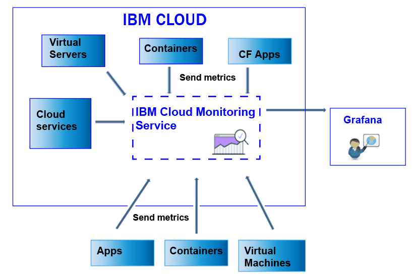

---

copyright:
  years: 2017

lastupdated: "2017-07-31"

---

{:shortdesc: .shortdesc}
{:new_window: target="_blank"}
{:codeblock: .codeblock}
{:screen: .screen}
{:pre: .pre}

# Sending and retrieving data
{: #send_retrieve_metrics_ov}

You can send and retrieve metrics from a {{site.data.keyword.Bluemix}} space into the {{site.data.keyword.monitoringshort}} service by using the Metrics API.
{:shortdesc}

The following figure shows a high level view of the different resources from where you can send metrics to the {{site.data.keyword.monitoringshort}} service:

## Sending metrics
{: #send}

For {{site.data.keyword.Bluemix_notm}} Docker containers, basic system metrics are automatically collected. For Cloud Foundry applications, and apps running in a Virtual Machine (VM), metrics must be sent directly from the app by using the Metrics API. 

To send metrics into the {{site.data.keyword.monitoringshort}} service, consider the following information: 

* You must set the {{site.data.keyword.Bluemix_notm}} space where you want to send the data.

* You must provide a security token or API key to work with the {{site.data.keyword.monitoringshort}} service. 

* You can use the API endpoint `https://metrics.ng.bluemix.net/v1/metrics`. For more information about the API, see [the Metrics API](https://console.bluemix.net/apidocs/927-ibm-cloud-monitoring-rest-api?&language=node#introduction){: new_window}.

Depending on the authentication model that you choose, choose one of the following options to send data into the {{site.data.keyword.monitoringshort}} service:
 
* To send metrics by using a UAA token, see [Sending metrics to a space by using UAA](/docs/services/cloud-monitoring/send-metrics/send_data_api.html#uaa).

* To send metrics by using an IAM token or an API key, see [Sending metrics to a space by using IAM or an API key](/docs/services/cloud-monitoring/send-metrics/send_data_api.html#iam).

## Retrieving metrics
{: #retrieve}

To retrieve metrics, consider the following information: 

* You must set the {{site.data.keyword.Bluemix_notm}} space from where you want to retrieve the data.

* You must provide a security token or API key to work with the {{site.data.keyword.monitoringshort}} service. 

* You must specify a path to 1 or more metrics. For more information, see [Defining the metrics](/docs/services/cloud-monitoring/retrieve-metrics/retrieve_data_api.html#metrics).

* Optionally, you can specify a custom time period. By default, if you do not specify a time period, the data that you retrieve is the data that corresponds to the last 24 hours. For more information, see [Configuring a period of time](/docs/services/cloud-monitoring/retrieve-metrics/retrieve_data_api.html#time).

* You can use the API endpoint `https://metrics.ng.bluemix.net/v1/metrics`. For more information about the API, see [the Metrics API](https://console.bluemix.net/apidocs/927-ibm-cloud-monitoring-rest-api?&language=node#introduction){: new_window}.

**Note:** You can retrieve a maximum of 5 targets per request.

Depending on the authentication model that you choose, choose one of the following options to retrieve data from the {{site.data.keyword.monitoringshort}} service:
 
* To retrieve metrics by using a UAA token, see [Retrieving metrics to a space by using UAA](/docs/services/cloud-monitoring/retrieve-metrics/retrieve_data_api.html#uaa).

* To retrieve metrics by using an IAM token or an API key, see [Retrieving metrics to a space by using IAM or an API key](/docs/services/cloud-monitoring/retrieve-metrics/retrieve_data_api.html#iam).

## Retrieving the list of metrics
{: #show_metrics}

You can list the metrics that are available in a space.

To list the metrics, consider the following information: 

* You must set the {{site.data.keyword.Bluemix_notm}} space for which you want to list the metrics that are available.

* You must provide a security token or API key to work with the {{site.data.keyword.monitoringshort}} service. 

* You must specify a query that defines the path from where to list the metrics. For example, to list all the metrics in a space, you can set the query to: `query=SpaceGUID.*` where *SpaceGUID* is the GUID of the space.

    The default is `*` which specifies the start point at the root level for the space.

* You can use the API endpoint `https://metrics.ng.bluemix.net/v1/metrics/list`. For more information about the API, see [the Metrics API](https://console.bluemix.net/apidocs/927-ibm-cloud-monitoring-rest-api?&language=node#introduction){: new_window}.

 